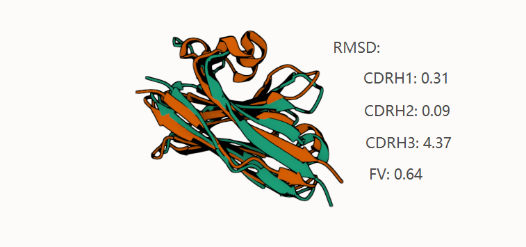

# AB RMSD



## Table of Contents

- [About](#about)
- [Getting Started](#getting_started)
- [Usage](#usage)

## About <a name = "about"></a>

Calculate the RMSD between two antibody structure (including nanobody and antibody).

## Getting Started <a name = "getting_started"></a>

First, install abnumber using conda.

```bash
conda install -c bioconda abnumber
```

Then, install ab_rmsd from github.

```bash
pip install git+https://github.com/pengzhangzhi/ab_rmsd.git
```

## Usage <a name = "usage"></a>

Calculate the RMSD between predicted and native nanobody structure.

```python
from ab_rmsd import calc_ab_rmsd

# two example pdb files are provided in the `example` folder.
native = "example/7d6y_1_B.pdb"
pred = "example/pred_7d6y_1_B.pdb"
rmsd = calc_ab_rmsd(native,pred)
print(rmsd)

"""
output:
{'CDRH1': tensor(0.3136), 'CDRH2': tensor(0.0898), 'CDRH3': tensor(4.3704), 'fv-H': tensor(0.6426)}
"""
```

```shell
abrmsd --pred pred_7d6y_1_B.pdb --native 7d6y_1_B.pdb --verbose

# Output:
[INFO] Renumbered chain B (H)
[INFO] Renumbered chain A (H)
    _    _       ____  __  __ ____  ____  
   / \  | |__   |  _ \|  \/  / ___||  _ \ 
  / _ \ | '_ \  | |_) | |\/| \___ \| | | |
 / ___ \| |_) | |  _ <| |  | |___) | |_| |
/_/   \_\_.__/  |_| \_\_|  |_|____/|____/ 

>>> Result
Frag    RMSD(Å)
CDRH1   0.3136
CDRH2   0.0898
CDRH3   4.3704
fv-H    0.6426
>>> End
```
# Credits

Part of the code is adapted from [shitong's Diffab](https://github.com/luost26/diffab).
